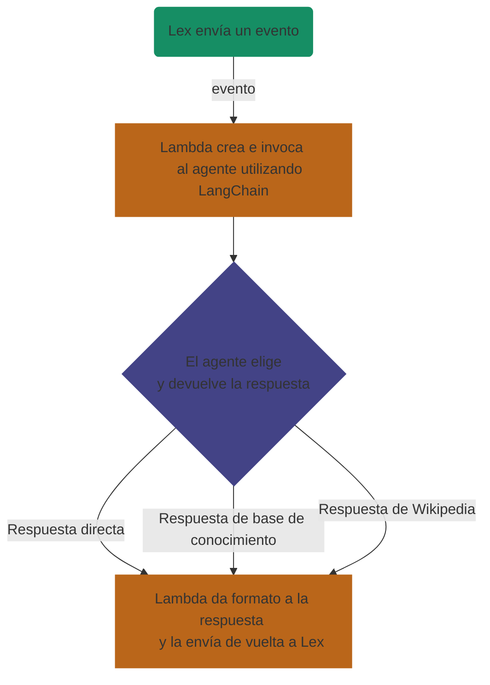

# Chatbot de IA con LangChain y AWS

[](https://t-enclave.com/pruebas-chat/)

## Resumen

Este proyecto desarrolla un chatbot inteligente que genera respuestas automáticas utilizando inteligencia artificial generativa y una base de conocimiento dinámica. La solución integra varios servicios de Amazon Web Services (AWS) y aprovecha las bibliotecas de [**LangChain**](https://github.com/langchain-ai/langchain "Ir a LangChain") y la [**Wikipedia API**](https://github.com/martin-majlis/Wikipedia-API "Ir a Wikipedia-API") para enriquecer las respuestas.

## IA Generativa con RAG

Se ha implementado un **agente ReAct**, utilizando la técnica de **Retrieval Augmented Generation (RAG)** para proporcionar respuestas precisas y actualizadas. Este agente interactúa con dos herramientas clave:

* **Herramienta de Base de Conocimiento**: primero creamos la base de conocimiento usando **Amazon Titan Embeddings** como el modelo de embeddings y **Pinecone** como la base de datos vectorial en la que se almacenarán los embeddings indexados. Luego, creamos la herramienta de base de conocimiento utilizando el método `create_retriever_tool` de **LangChain**, transformando nuestro recuperador en un objeto `Tool` para que el agente pueda acceder a él y ejecutarlo.

  ```python
  from langchain.tools.retriever import create_retriever_tool

  retriever_tool = create_retriever_tool(
    name="Knowledge Base",
    description="Con esta herramienta puedes acceder a una base de conocimiento personalizada.",
    retriever=kb_retriever
  )
  ```
  
* **Herramienta de Wikipedia**: usando la misma clase Tool de antes, y la función from_function, creamos la herramienta de Wikipedia a partir de una función personalizada que primero verifica si la página de Wikipedia existe; si es así, la API resume la página deseada.

  ```python
  import wikipediaapi
  from langchain.agents.tools import Tool

  def search_wikipedia(self, title):
    wiki_wiki = wikipediaapi.Wikipedia('SampleProject/0.0 (example@example.com)', 'en')
    page = wiki_wiki.page(title)
      
    if page.exists():
      tools_logger.info(f"HERRAMIENTAS: Página encontrada:\n{page.summary}")
      return page.summary 
    else:
      tools_logger.info("HERRAMIENTAS: Página no encontrada en Wikipedia")
      return "No se encontró ninguna página en Wikipedia que coincida con tu búsqueda."


  wikipedia_tool = Tool.from_function(
    func=self.search_wikipedia,
    name="Wikipedia",
    description="Con esta herramienta puedes acceder a Wikipedia para resumir diferentes temas que no conoces."
  )
  ```

## Servicios AWS Usados

La solución depende de varios servicios de AWS para asegurar una integración fluida y eficiencia en costos. Los principales servicios son:

* **S3**: Almacena archivos .pdf que contienen información estructurada que la herramienta de base de conocimiento usa para generar respuestas claras y precisas.
* **Lex**: Proporciona la interfaz de usuario para el chatbot, incluyendo servicios de voz como Amazon Transcribe y Amazon Polly.
* **Bedrock**: Actúa como el centro para la selección de modelos fundamentales (FM) y como el anfitrión para la base de conocimiento.
* **Lambda**: Funciona como un servicio sin servidor que facilita las llamadas al agente de IA y sus herramientas, ofreciendo escalabilidad automática, seguridad y flexibilidad.

## Descripción de la Funcionalidad

El flujo general del chatbot es el siguiente:

* **Recepción de Evento**: AWS Lambda recibe un evento de Amazon Lex.
* **Generación de Respuesta**: Lambda llama al agente de IA que usa LangChain para procesar el evento.
* **Consulta a la Base de Conocimiento**: El agente emplea RAG para buscar información en la base de conocimiento alojada en Amazon Bedrock.
* **Acceso a Wikipedia**: Si se necesita información adicional, el agente consulta Wikipedia usando su API.
* **Respuesta al Usuario**: La respuesta generada se formatea y se envía de vuelta a Amazon Lex, que la presenta al usuario.


